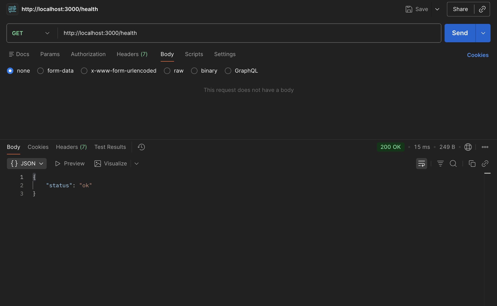
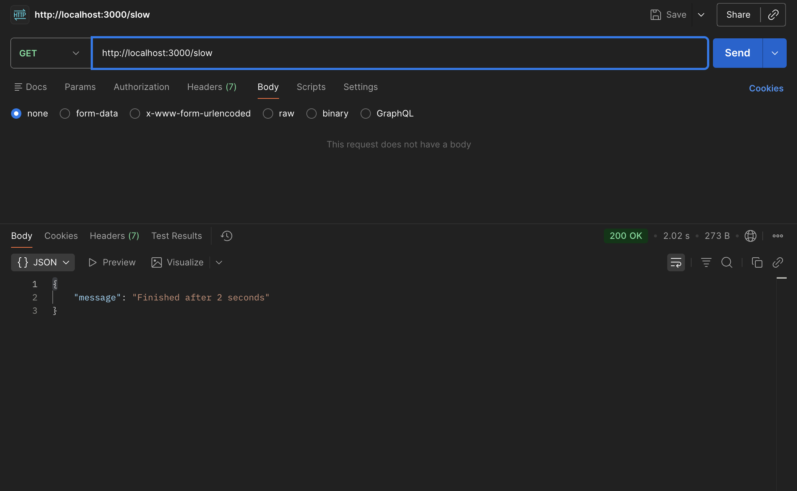
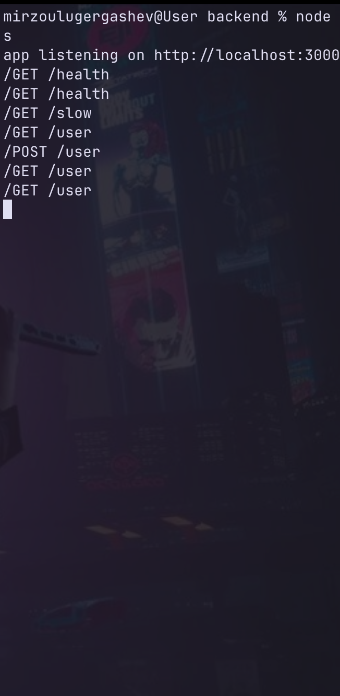
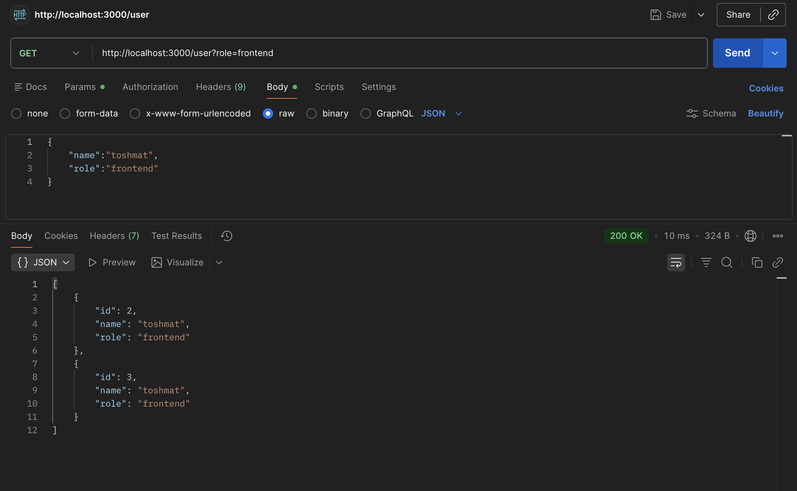
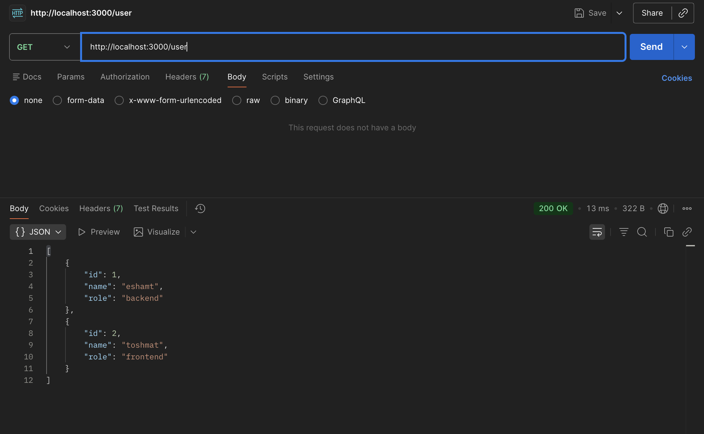

# Backend

Simple Express backend running on `http://localhost:3000`.

## Setup

```sh
npm install
node app.js
```

## Endpoints

| Method | Path | Description |
| --- | --- | --- |
| `GET` | `/health` | Returns server status. |
| `GET` | `/slow` | Waits 2 seconds, then returns a message. |
| `GET` | `/user` | Returns all users. |
| `GET` | `/user?role=frontend` | Returns users filtered by role. |
| `POST` | `/user` | Adds a user from JSON body with `name` and `role`. |

## Short Answers

**What happens when a client sends a request to a server?**

The server receives the request, processes it, and sends back a response.

**Why is async important in backend?**

Async lets the server handle other work while waiting for slow tasks like database calls, APIs, or timers.

## Screenshots

### Health Check



### Slow Endpoint



### Server Logs



### Create User



### List Users


